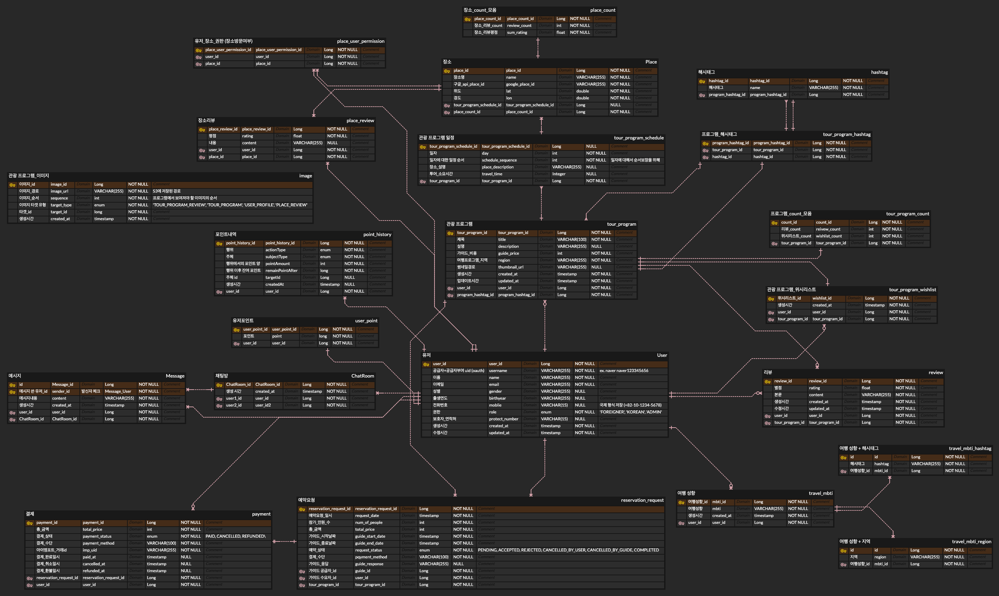
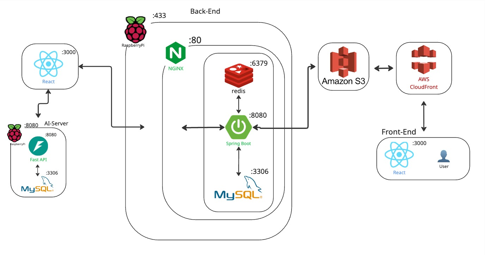
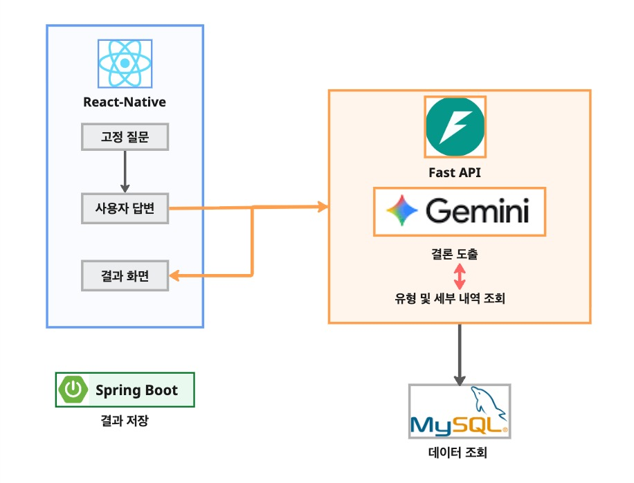
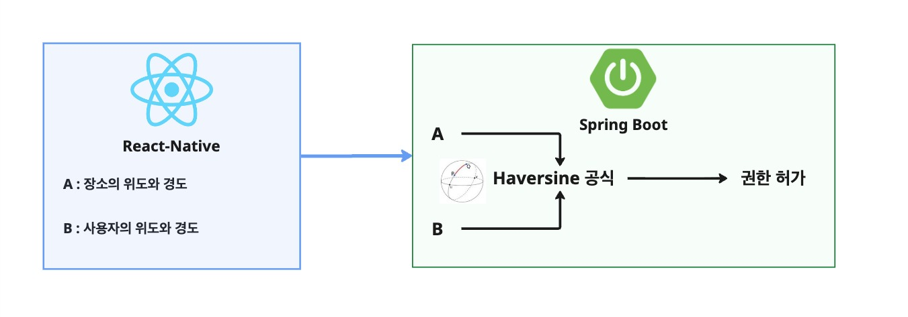
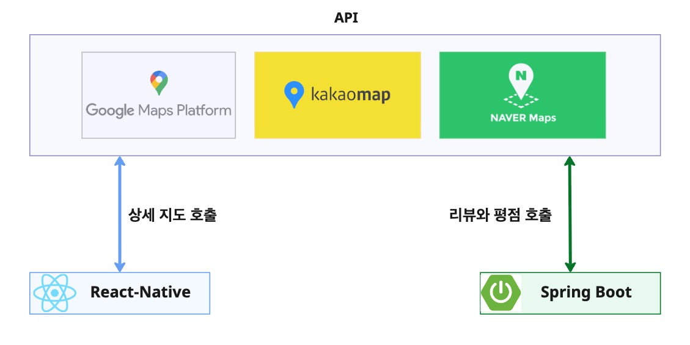
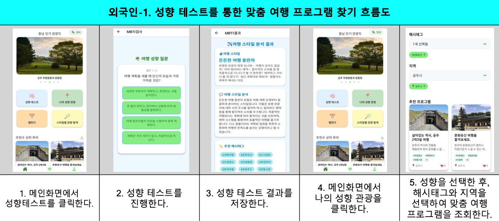
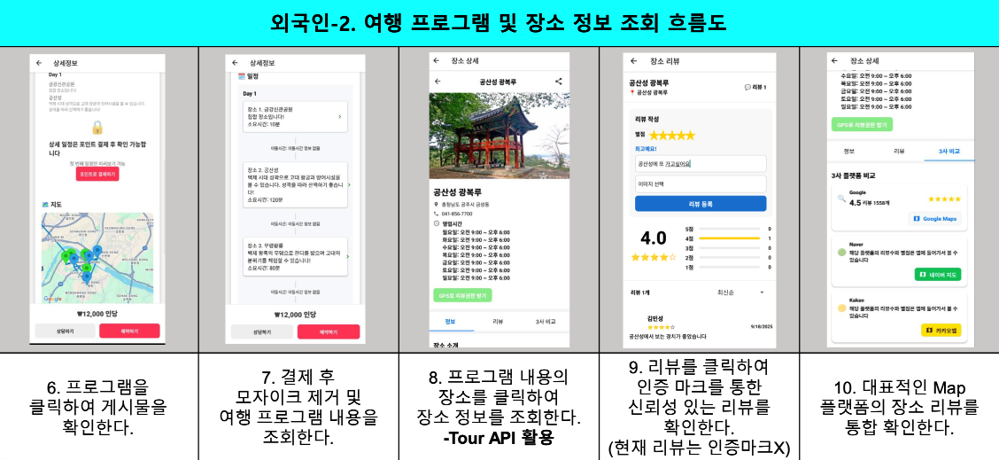
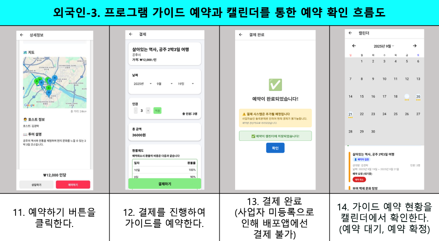
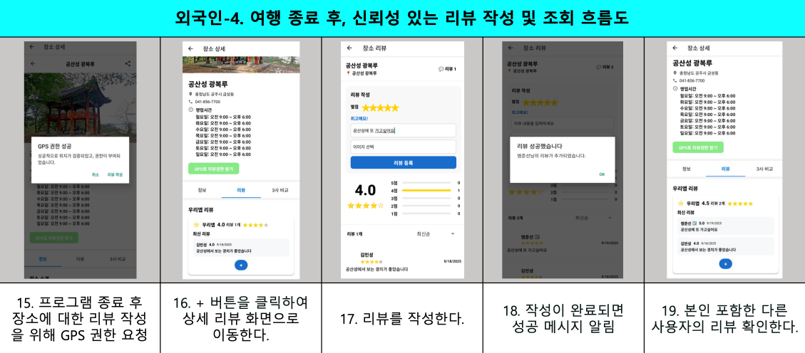
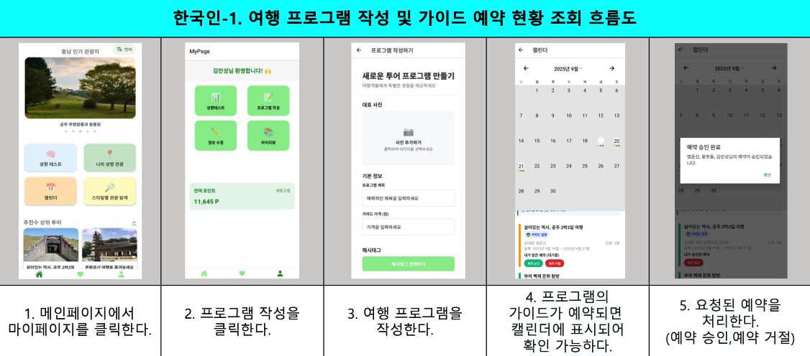

# TravelLocal

## 대한민국의 관광 소도시를 여행하고 싶어 하는 외국인 관광객과, 숨은 매력을 공유하고 싶은 현지인을 연결하는 '현지인 기반 여행 정보 플랫폼'

### 개발배경:

대한민국을 찾는 많은 외국인 관광객은 서울과 같은 대도시에 집중하고 있습니다. 그러나 최근 글로벌 여행 트렌드는 단순 관광을 넘어 '현지에서만 느낄 수 있는 로컬 경험'으로 이동하고 있습니다.
한국관광공사가 발표한 2025년 관광 트렌드 분석에서도 '로컬리즘 추구'가 핵심 키워드로 제시되었습니다. 이는 외국인 관광객이 대도시가 아닌 관광 소도시에서 한국의 현지를 느끼고자 하는 수요가 분명히 존재함을 보여줍니다.
하지만 기존 여행 플랫폼들은 대도시에만 집중되어 있어, 이러한 여행자들은 관광 소도시 방문을 원해도 정보 부족으로 인해 여행 계획 수립에 큰 어려움을 겪고 있습니다. TravelLocal은 바로 이 지점에서 시작합니다.
상업적 추천에 지친 '현지 경험 중심 여행자'의 미충족 수요를 해결하고, 정보가 부족했던 숨겨진 소도시의 잠재력을 발굴하여경쟁이 치열한 레드오션이 아닌 가능성의 '블루오션' 시장에서 시작하고자 합니다.
이는 나아가 지방 관광산업 활성화를 촉진하는 원동력이 될 수 있습니다.

### 서비스 주 이용 대상:

광고성 정보를 싫어하며 숨겨진 현지 경험을 추구하는 외국인 여행자  
자신만의 경험을 공유하고 싶으며 수익창출을 원하는 관광 소도시 현지인

### 다운로드 링크

[](https://m.onestore.co.kr/v2/ko-kr/app/0001002385)

---

## 기여자

| 이름   | Github 프로필                              | 역할                |
| ------ | ------------------------------------------ | ------------------- |
| 김경탁 | [ryuseunghan](https://github.com/kkt9253)  | Backend 팀장, Infra |
| 염준선 | [mjgwon24](https://github.com/yeomjunseon) | Backend             |
| 김민성 | [seocylucky](https://github.com/gitget1)   | Frontend 팀장       |
| 황효동 | [HeoYeonGyu](https://github.com/gyehd0107) | AI, Frontend        |

---

## 서비스 아키텍쳐



---

## 서비스 ERD



---

## 기술 스택

### Frontend

- React Native
- TypeScript
- React Navigation
- React Query
- Socket.io Client
- React Hook Form
- i18next (다국어 지원)
- React Native Gesture Handler
- React Native Reanimated

---

## 주요 기능

| 기능 설명                                                                                                                                                                                                     |                                          기능 아키텍쳐                                          |
| :------------------------------------------------------------------------------------------------------------------------------------------------------------------------------------------------------------ | :---------------------------------------------------------------------------------------------: |
| <big><big>**AI 성향 테스트**</big></big> <br> 사용자는 간단한 문항을 통해 자신의 여행 성향을 확인할 수 있으며, AI가 이를 분석하여 개인의 성격과 취향에 맞는 여행 스타일을 제시합니다.                         |  |
| <big><big>**GPS 로그 기반의 신뢰도 높은 리뷰**</big></big> <br> GPS 인증을 통해 실제 방문이 증명된 리뷰에 인증 마크를 부여하여 정보의 신뢰도를 높입니다. 허위 리뷰나 악의적인 평가를 쉽게 구분할 수 있습니다. |  |
| <big><big>**여러 플랫폼의 리뷰 통합 비교**</big></big> <br> 자사 리뷰뿐만 아니라 Google, Naver 등 여러 플랫폼의 평점과 리뷰를 한 화면에서 동시에 제공하여 객관적인 판단을 돕습니다.                           |  |
| <big><big>**현지인이 직접 만드는 여행 프로그램**</big></big> <br> 현지인이 직접 여행 코스를 등록하는 C2C 방식을 통해, 지역 주민만 아는 숨은 명소 등 생생한 여행 정보를 제공합니다.                            |                                          _아키텍쳐 X_                                           |

---

## 서비스 흐름도

|                        서비스 흐름도                         |                                                              실행 영상                                                              |
| :----------------------------------------------------------: | :---------------------------------------------------------------------------------------------------------------------------------: |
|  |                                                                            |
|  |                                                                       |
|  |  |
|  |                                                                           |
|     |              |

---

# Getting Started

> **Note**: Make sure you have completed the [React Native - Environment Setup](https://reactnative.dev/docs/environment-setup) instructions till "Creating a new application" step, before proceeding.

## Step 1: Start the Metro Server

First, you will need to start **Metro**, the JavaScript _bundler_ that ships _with_ React Native.

To start Metro, run the following command from the _root_ of your React Native project:

```bash
# using npm
npm start

# OR using Yarn
yarn start
```

## Step 2: Start your Application

Let Metro Bundler run in its _own_ terminal. Open a _new_ terminal from the _root_ of your React Native project. Run the following command to start your _Android_ or _iOS_ app:

### For Android

```bash
# using npm
npm run android

# OR using Yarn
yarn android
```

### For iOS

```bash
# using npm
npm run ios

# OR using Yarn
yarn ios
```

If everything is set up _correctly_, you should see your new app running in your _Android Emulator_ or _iOS Simulator_ shortly provided you have set up your emulator/simulator correctly.

This is one way to run your app — you can also run it directly from within Android Studio and Xcode respectively.

## Step 3: Modifying your App

Now that you have successfully run the app, let's modify it.

1. Open `App.tsx` in your text editor of choice and edit some lines.
2. For **Android**: Press the <kbd>R</kbd> key twice or select **"Reload"** from the **Developer Menu** (<kbd>Ctrl</kbd> + <kbd>M</kbd> (on Window and Linux) or <kbd>Cmd ⌘</kbd> + <kbd>M</kbd> (on macOS)) to see your changes!

   For **iOS**: Hit <kbd>Cmd ⌘</kbd> + <kbd>R</kbd> in your iOS Simulator to reload the app and see your changes!

## Congratulations! :tada:

You've successfully run and modified your React Native App. :partying_face:

### Now what?

- If you want to add this new React Native code to an existing application, check out the [Integration guide](https://reactnative.dev/docs/integration-with-existing-apps).
- If you're curious to learn more about React Native, check out the [Introduction to React Native](https://reactnative.dev/docs/getting-started).

# Troubleshooting

If you can't get this to work, see the [Troubleshooting](https://reactnative.dev/docs/troubleshooting) page.

# Learn More

To learn more about React Native, take a look at the following resources:

- [React Native Website](https://reactnative.dev) - learn more about React Native.
- [Getting Started](https://reactnative.dev/docs/environment-setup) - an **overview** of React Native and how setup your environment.
- [Learn the Basics](https://reactnative.dev/docs/getting-started) - a **guided tour** of the React Native **basics**.
- [Blog](https://reactnative.dev/blog) - read the latest official React Native **Blog** posts.
- [`@facebook/react-native`](https://github.com/facebook/react-native) - the Open Source; GitHub **repository** for React Native.

# Android

• buildToolsVersion = "34.0.0"
→ Android Build Tools 34.0.0 사용

• minSdkVersion = 23
→ Android 6.0 (API 23) 이상 기기에서 앱 실행 가능

• compileSdkVersion = 34
→ 앱을 Android 14 (API 34) 기준으로 컴파일

• targetSdkVersion = 34
→ 앱이 Android 14 (API 34) 버전에 맞춰 최적화됨

• ndkVersion = "26.1.10909125"
→ NDK 26.1.10909125 버전 사용 (C/C++ 네이티브 빌드)

• kotlinVersion = "1.9.24"
→ Kotlin 1.9.24 버전 사용 (Kotlin 코드가 있을 경우)
